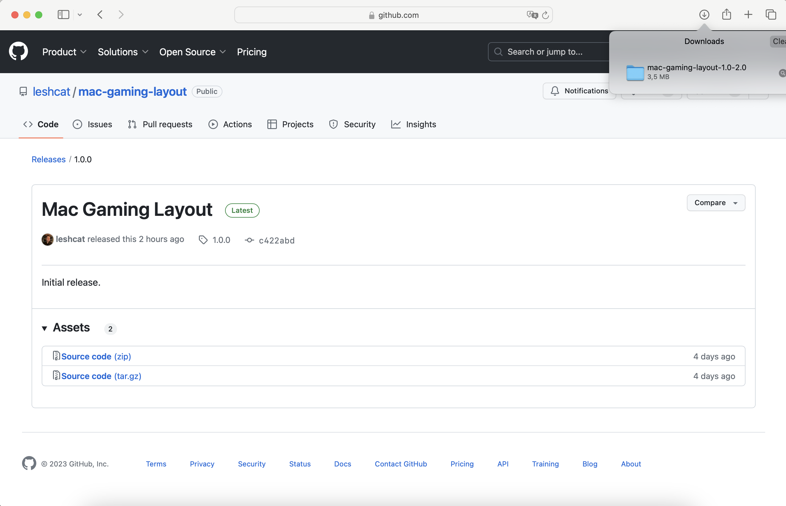
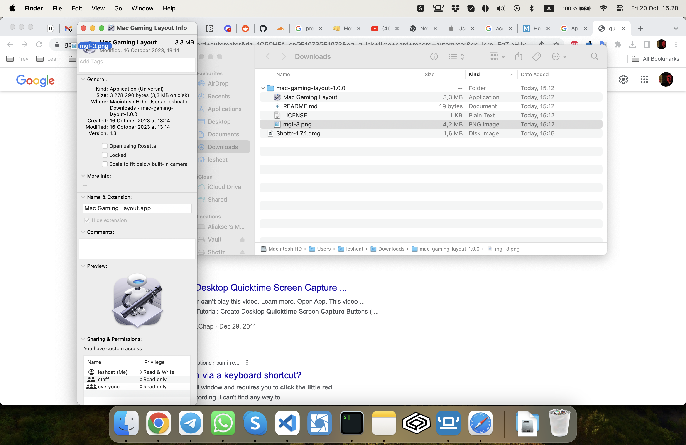
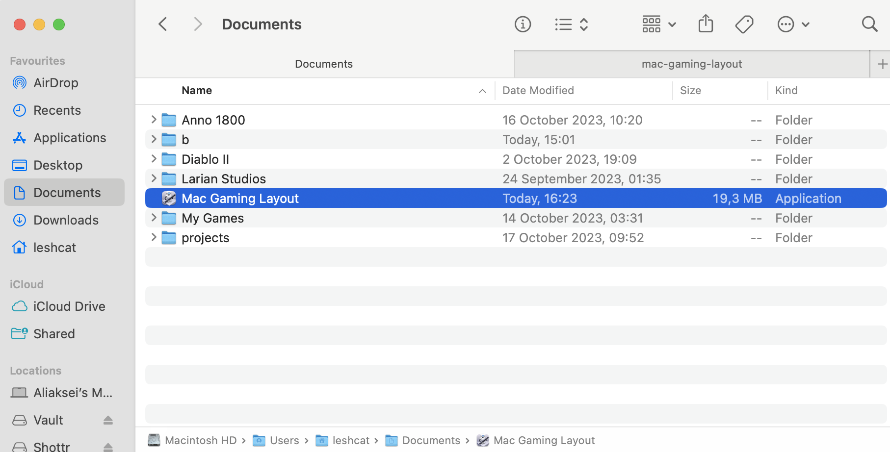
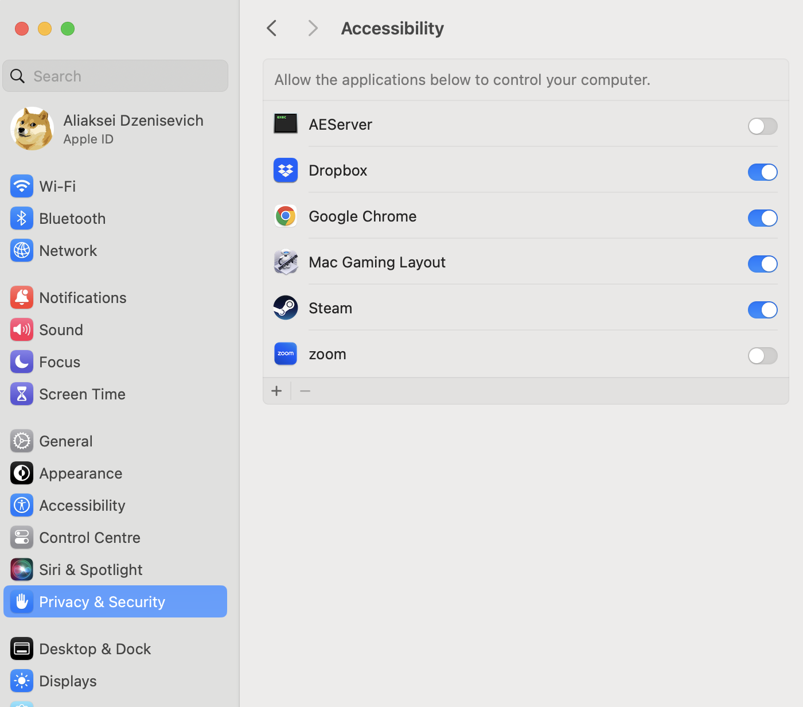
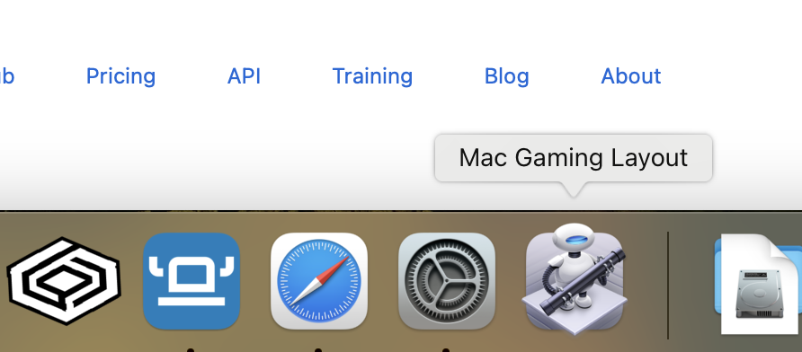

# mac-gaming-layout

## Installation

1. Download latest release

2. Unpack it and change the icon as shown below:

3. Place it in *Documents* folder:

4. Allow Accessibility in Security Settings:

5. Put it to Dock:

6. Run it!